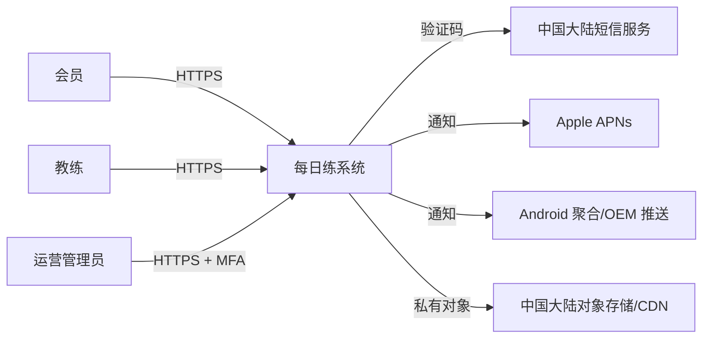

# 系统架构

## 硬约束与质量预算

| Attribute | Target/range | Evidence | State | Revisit trigger |
|---|---|---|---|---|
| 平台/技能 | Flutter 覆盖会员 iOS/Android/Web 与教练 Web；后端 TypeScript | 用户输入 | confirmed constraints；单 Flutter Web 工程 provisional | 桌面可用性/包体或无障碍无法达标 |
| 规模 | 20k DAU；设计基线 100 API RPS、20 并发照片完成回调 | 用户估计 + 容量默认 | provisional | 7 天 p95 峰值 >60 RPS 或压测不达 2 倍余量 |
| 延迟 | 常用非上传 API 服务端 p95 <500 ms；列表首屏 p95 <800 ms | 体验默认 | provisional | Beta 实测/业务优先级变化 |
| 可用性 | 核心 API 月度成功率 99.9%，排除计划维护；依赖失败可降级 | 预算/团队默认 | provisional | 商业承诺或事故成本改变 |
| 恢复 | PostgreSQL RPO ≤15 分钟、RTO ≤4 小时；对象 RPO ≤24 小时、RTO ≤8 小时 | 运营默认 | provisional | 合规/商业要求更严或演练不达标 |
| 成本 | 月基础设施 ≤8,000 元 | 用户输入 | confirmed ceiling | 预测 >80% 或照片流量超假设 |
| 数据地域 | 生产个人数据与备份留在中国大陆 | 简化/合规默认 | provisional | 任何境外处理器或支持访问被提出 |

## 系统上下文

信任边界：公网客户端↔边缘/API；API↔私网数据层；系统↔短信/推送处理者；教练/运营特权边界；对象存储签名访问边界。APNs 和任何境外可达服务在投产前由隐私负责人确认数据字段与跨境路径，未确认时不发送个人内容，仅使用不含训练/身份的通用提醒文案。

## 容器与可部署单元

| Unit | Responsibility | Interfaces | Data owned | Owner | State |
|---|---|---|---|---|---|
| Flutter client | 会员三端与教练角色页面、缓存、权限、上传编排 | REST/JSON HTTPS、对象直传 | 本地短期缓存/草稿，无权威业务数据 | mobile-lead | provisional |
| TypeScript API | 认证、授权、业务规则、签名 URL、管理 API | `/api/v1` REST/OpenAPI | 通过模块访问 PostgreSQL | backend-lead | provisional |
| Worker/scheduler | 照片完成、安全处理、提醒调度/重试、删除任务 | DB lease、服务商 HTTPS | job 状态，不拥有业务实体 | backend-lead | provisional |
| PostgreSQL | 单一事务事实源、作业表、审计索引 | TLS 私网 SQL | 账号、计划、打卡、元数据、设置、审计 | backend-lead | provisional |
| Object storage | 私有原图、处理图、缩略图、删除生命周期 | 预签名 PUT/GET、服务端 API | 二进制照片 | security-owner | provisional |
| CDN/WAF/LB | TLS、静态 Web、限流、受控图片分发 | HTTPS | 无持久业务数据 | ops-owner | provisional |

API 与 Worker 来自同一模块化单体代码库和镜像，可独立扩缩但一起发布；不是微服务。Flutter 使用一个仓库/设计系统，会员和教练按入口与角色裁剪路由。

## 模块边界

| Module | Responsibility | Allowed dependencies | Related SPEC |
|---|---|---|---|
| Identity | OTP challenge、session、actor context | SMS adapter、audit | SPEC-IDENTITY-001..003 |
| Member/Coach access | 会员归属、RBAC/对象级策略 | Identity、audit | SPEC-COACH-001 |
| Plan | 草稿、不可变发布版本、生效解析 | Access、audit | SPEC-PLAN-001..002, SPEC-COACH-003 |
| Checkin | 唯一训练日记录、编辑窗口、历史 | Plan、Access、Media metadata | SPEC-CHECKIN-001..002 |
| Media | 上传意图、状态、授权读取、删除 | Access、object adapter、jobs | SPEC-MEDIA-001..002 |
| Reminder | 偏好、时区调度、投递去重 | Checkin read model、push adapter、jobs | SPEC-REMINDER-001..002 |
| Privacy | 告知版本、同意/撤回证据、权利工单、注销编排 | 各模块显式删除接口、audit | SPEC-PRIVACY-001..002 |
| Audit | 追加式安全/管理事件 | 无业务模块反向依赖 | SPEC-COACH-001 |

禁止模块直接读取其他模块私有表；MVP 可同库同 schema，但通过 TypeScript 接口和 migration ownership 执行边界。

## 数据与一致性

| Data/entity | Source of truth | Classification | Consistency/transaction | Retention |
|---|---|---|---|---|
| Account/session | PostgreSQL | 个人/认证机密 | OTP 单次消费与会话创建同事务 | 见 SECURITY.md |
| Coach assignment | PostgreSQL | 内部 + 个人关系 | 授权请求时强一致读取/短缓存禁越权 | 关系期 + 审计期 |
| Plan/version | PostgreSQL | 个人/内部内容 | 发布用乐观版本；已发布版本不可变 | 账号期 + 删除策略 |
| Checkin | PostgreSQL | 敏感个人信息（保守分类） | `(member_id, local_date)` 唯一；幂等键唯一 | 账号期 + 删除策略 |
| Photo binary | 私有对象存储 | 敏感个人信息（保守分类） | DB 状态机 `initiated→processing→ready/rejected/deleting` | 账号期；删除后 24h 源对象 |
| Reminder/device token | PostgreSQL | 个人信息/凭据 | `(user, day)` 投递去重；token 轮换 | 失效/退出后删除 |
| Job/audit | PostgreSQL | 内部/安全 | lease + attempt；审计追加式 | job 30d；审计 provisional 180d |

## 身份、会话与授权

- 手机 OTP 换取 15 分钟访问令牌与 30 天轮换刷新令牌（provisional）；刷新令牌只保存哈希，移动端放系统安全存储，Web 用 `Secure`/`HttpOnly`/`SameSite` cookie。
- 教练由运营邀请，不允许自助升级；教练首次和每 90 天重新验证，生产管理员必须 MFA（具体 IdP 可后补，不改变会员认证）。
- API 每次对象访问检查 actor、role、assignment 和对象 owner；前端隐藏不是授权控制。
- 关键审计：教练登录、会员敏感详情/照片读取、分配变化、计划发布、权限变化、权利请求和导出。

## 接口与集成

| Interface | Contract/versioning | Auth | Timeout/retry/idempotency | Degradation |
|---|---|---|---|---|
| Client→API | OpenAPI `/api/v1`; additive changes; 两个移动版本窗口 | bearer/cookie + object auth | read 3s；write 5s；仅幂等写自动重试 | 缓存只读/草稿；健康端点区分依赖 |
| API→SMS | adapter + provider request ID | secret in vault | connect 1s/total 3s；同 challenge 幂等；最多 1 次安全重试 | 登录暂不可用，体验训练可用 |
| Worker→push | channel adapter，payload schema v1 | token/key | 3s；指数退避至提醒窗口末；day 去重 | App 内今日提示；不改打卡 |
| Client→object | 单对象预签名 PUT，key/size/type 受限 | 5 分钟签名 | 客户端单文件重试；完成回调幂等 | 允许无照片打卡 |
| API→object GET | 受权后短时签名或鉴权 CDN | object authorization | 3s；不对 4xx 重试 | 照片不可用不阻断文字历史 |
| API/Worker→PostgreSQL | migration-locked schema | private TLS credential | statement timeout 2s API/30s job；事务级重试 | 失败时拒绝写，禁止本地假成功 |

所有外部 provider adapter 保留内部中性模型和 provider ID；更换供应商不改变领域接口。

## 照片上传动态视图

1. 客户端向 Media 请求上传意图（数量、声明类型/大小）。
2. API 鉴权并创建 `initiated` 元数据，返回限定 key/大小/5 分钟的上传凭据。
3. 客户端直传私有隔离前缀，再调用幂等 finalize。
4. Worker 校验实际格式/尺寸、解码重编码去 EXIF、生成缩略图并执行安全扫描；成功移入私有 ready 前缀，失败隔离/删除。
5. 只有 `ready` 可通过对象级鉴权读取；删除先撤销界面与签名，再异步删对象。

## 提醒投递动态视图

1. scheduler 按 UTC 分片查找未来窗口，向 PostgreSQL `jobs` 插入 `(user, local_date, type)` 唯一任务。
2. worker 用带超时 lease 领取任务，发送前再次检查偏好、时区与当日打卡。
3. 通过 APNs 或已批准 Android adapter 投递通用文案，保存 provider 回执/错误类别。
4. 临时错误在窗口内退避；永久 token 错误停用 token；任何结果不写打卡。

## 技术与中间件决策

| Decision | Hard constraints | Candidates | Recommendation | Tradeoff | State | Revisit trigger |
|---|---|---|---|---|---|---|
| 客户端 | 3 人 Flutter、三端、6 月 | Flutter 单代码库；Flutter+React 教练端；全原生 | Flutter 单代码库，角色路由共享组件 | 桌面密集表格/SEO 弱；少一种栈 | provisional | 教练任务达标率 <90% 或 Web 无障碍阻断 |
| Backend | TypeScript、小团队、模块多 | NestJS；Fastify 裸框架；Next API | NestJS 模块化单体 + Fastify adapter | 框架开销换边界/验证/DI | provisional | p95/内存预算失败或团队已有标准 |
| Data access | PostgreSQL、类型安全、迁移 | Prisma；Drizzle；手写 SQL | Prisma + 显式 SQL 处理锁/队列 | 特殊 SQL 需逃生口 | provisional | 迁移/性能无法满足或团队熟悉度相反 |
| Database | 事务、版本/授权、20k DAU | PostgreSQL；MySQL；文档库 | 托管 PostgreSQL 单实例高可用规格 | 单主写；最低运维 | provisional | 写入/存储超单实例 60% 持续 30d |
| Background jobs | 提醒/照片需持久重试，预算紧 | PostgreSQL job table；Redis queue；broker | PostgreSQL lease job table + worker | 增加 DB 负载，省独立系统 | provisional | 队列积压 >5 分钟或 jobs >20% DB 负载 |
| Cache | 当前无热点证据 | 无；Redis；CDN | 不上 Redis；静态/图片用 CDN，查询靠索引 | 少一层保护 | provisional | DB p95 超预算且查询优化后仍失败 |
| Search/realtime | 精确搜索、无需秒级推送页面 | PostgreSQL prefix；搜索引擎；WebSocket | PostgreSQL 索引 + 页面刷新 | 不支持模糊相关性/实时协作 | provisional | 需要中文模糊检索或实时协作被确认 |
| Deployment | 中国大陆、8k/月、无平台团队 | 托管容器/PaaS；ECS Docker；Kubernetes | 国内云托管容器/PaaS + 托管 PG/对象存储 | 供应商依赖，降低运维 | provisional | 成本超 8k、能力/备案不适配或迁移演练失败 |

明确不采用：微服务、Kubernetes、独立消息 broker、Redis、搜索引擎、WebSocket。引入前必须提交 ADR 和量化证据。

## 失败与演进

- SMS 不可用：保留体验训练，登录显示可重试；不得切换未经隐私/合同评审的供应商。
- 推送不可用：训练/打卡不受影响，站内显示今日任务；不积压过期提醒。
- 对象存储/处理失败：允许无照片打卡；文字历史可用；隔离中对象不可见。
- 数据库不可用：拒绝写且不假成功；只读缓存标旧，启动事故流程。
- 供应商退出：导出 PostgreSQL 标准备份和对象 manifest；adapter 切换演练后再改流量。
- 拆分触发：独立团队/发布节奏、隔离法规、单模块持续 >60% 资源或明确可靠性边界；先拆 worker，再考虑媒体/提醒，不按表拆服务。

## 待决定事项

| TBD ID | Decision | Owner | Decision by | Blocked gate | State |
|---|---|---|---|---|---|
| TBD-ARCH-001 | 以团队 PoC 确认 NestJS/Prisma 与国内托管容器具体组合 | tech-lead | M1 末 | production-ready | pending |

