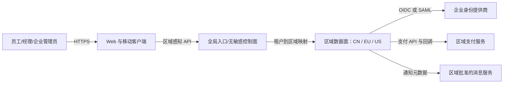

# 系统架构

## 约束与质量预算

| Attribute | Target/range | Evidence | State | Revisit trigger |
|---|---|---|---|---|
| 数据驻留 | 欧盟租户受约束数据与备份仅在欧盟持久化 | 区域策略测试、数据资产清单、供应商证明 | confirmed；范围待法务确认 | TBD-LEGAL-001 结论变化 |
| 恢复 | 生产 RPO ≤15 分钟、RTO ≤2 小时 | 每区域恢复演练 | confirmed | 客户分级目标变化 |
| 租户隔离 | 每次数据访问和对象存储访问都有租户作用域 | 自动隔离测试+渗透测试 | provisional | 独享实例合同或隔离测试失败 |
| 性能 | 尚无用户可见延迟/吞吐目标 | TBD-SLO-001 | pending | 容量模型确认 |
| 可用性 | 尚无生产 SLO | TBD-SLO-001 | pending | 商务 SLA 确认 |
| 容量/成本 | 用户、峰值请求、发票大小与增长未知 | TBD-COST-001 | pending | 客户/财务输入 |

## 系统上下文

- 全球入口只保存不含身份、发票、银行账户或业务载荷的最小租户路由元数据；该最小集合仍需法务/安全确认。
- CN、EU、US 数据面逻辑一致、独立部署和独立数据存储。任何跨区运营查询默认只聚合非敏感指标。
- 客户端不是信任边界；区域数据面在每次请求重新验证身份、租户和权限。

## 区域拓扑

采用 [ADR 0001](docs/adr/0001-regional-data-cells.md) 的暂定“区域数据单元”方案。租户创建时绑定一个 home region。控制面解析后返回/代理到对应区域；数据面拒绝区域不匹配。EU 故障恢复限定在欧盟内的多可用区或第二欧盟站点，禁止自动跨到 US/CN。

## 容器与可部署单元

| Unit | Responsibility | Interfaces | Data owned | Owner | State |
|---|---|---|---|---|---|
| Web client | 登录、提交、审批、预算与审计 UI | HTTPS API | 无持久业务事实 | 前端团队 | provisional |
| iOS/Android client | 移动采集、状态与审批 | HTTPS API、相机/文件权限 | 受控本地草稿 | 移动团队 | provisional |
| Global routing control plane | 租户到区域路由、区域健康，不含业务载荷 | HTTPS/内部路由 | 租户伪名与 home region | 平台团队 | provisional |
| Regional API | 领域用例、授权、事务与 API | REST/JSON（暂定） | 区域业务数据 | 应用团队 | provisional |
| Regional worker | 文件扫描、通知、支付对账、审计导出 | DB-backed jobs/供应商 API | 短期任务状态 | 应用团队 | provisional |
| Regional relational DB | 费用、审批、预算、身份映射、支付状态 | 私网 SQL | 结构化事实 | 数据平台 | provisional |
| Regional object store | 原始发票与派生预览 | 私网/短期签名 URL | 文件对象 | 平台团队 | provisional |
| Regional immutable audit store | 安全与业务审计证据 | append-only 写入/受控查询 | 审计事件 | 安全团队 | provisional |

## 模块边界

| Module | Responsibility | Allowed dependencies | Related SPEC |
|---|---|---|---|
| Tenant & Identity | SSO 配置、身份映射、角色和会话 | Audit；不得直接读其他租户 | SPEC-IDENTITY-001, SPEC-IDENTITY-002 |
| Expense | 草稿、字段、发票引用、提交版本 | Budget policy、File、Audit | SPEC-EXPENSE-001, SPEC-EXPENSE-002 |
| Approval | 待办与决定状态机 | Expense、Budget snapshot、Audit | SPEC-APPROVAL-001 |
| Budget | 预算规则版本与占用语义 | Audit | SPEC-BUDGET-001 |
| Payment | 付款意图、供应商适配、回调与对账 | Approved expense、Audit | SPEC-PAYMENT-001, SPEC-PAYMENT-002 |
| File | 上传、隔离、扫描、预览、签名访问 | Object store、Audit | SPEC-EXPENSE-002 |
| Audit | 规范事件、检索和导出 | Regional audit store | SPEC-AUDIT-001 |

## 数据与一致性

| Data/entity | Source of truth | Classification | Consistency/transaction | Retention |
|---|---|---|---|---|
| 租户与区域映射 | 控制面元数据存储 | confidential；不得含用户身份 | 强一致；区域变更人工流程 | 租户期内+合同要求，待确认 |
| 用户身份映射/角色 | 区域关系库 | personal/confidential | 角色变更与审计同事务/事务发件箱 | TBD-LEGAL-001 |
| 费用/审批/预算 | 区域关系库 | confidential，可能含 personal | 单实体状态转移强一致；乐观并发 | TBD-LEGAL-001 |
| 发票/预览 | 区域对象存储 | sensitive personal/confidential | 先隔离、扫描通过后可引用 | TBD-LEGAL-001 |
| 银行账户引用 | 区域关系库；尽量保存供应商 token 与掩码 | sensitive personal/financial | 付款前版本固定 | TBD-LEGAL-001 |
| 支付状态 | 区域关系库，供应商是外部执行事实来源 | financial/confidential | 幂等状态机+定期对账 | TBD-LEGAL-001 |
| 审计事件 | 区域 append-only 存储 | confidential，部分 personal | 事务发件箱后最终写入；完整性检测 | TBD-SECURITY-002 |

## 费用与文件流

1. 客户端向 home region 请求上传会话，服务端验证租户和角色。
2. 文件只上传到该区域隔离区；worker 扫描并生成安全预览。
3. Expense 模块仅接受已通过扫描的对象引用；提交事务同时写状态和审计发件箱。
4. 原文件访问使用短期、单对象、租户绑定的授权，不暴露永久公共 URL。

## 身份与授权边界

- 暂定每租户 OIDC/SAML 联邦，区域 API 验证协议结果并建立本地会话；协议组合待 TBD-IDENTITY-001。
- 授权使用 RBAC 加资源范围（tenant、organization、approval assignment）；数据库访问接口强制传入 tenant context。
- 平台支持访问为独立特权路径，默认无业务数据权限；紧急访问需限时审批、强认证和告警。

## 支付集成流

1. Payment 模块在区域事务中创建唯一付款意图和幂等键。
2. 区域 worker 调用该市场批准的供应商；超时保留 `unknown/pending-confirmation`。
3. 区域专用回调端点验证签名、时间窗与事件 ID，按允许状态机更新。
4. 定时对账只传输最小必要字段；差异进入人工队列。平台保存 token/掩码，原则上不保存完整账户凭据。

## 接口与集成

| Interface | Contract/versioning | Auth | Timeout/retry/idempotency | Degradation |
|---|---|---|---|---|
| Client API | `/v1` REST/OpenAPI（暂定），旧移动版本兼容窗待定 | 短期会话+租户上下文 | 写请求幂等键；安全重试 | 区域不可用时失败关闭或只读 |
| SSO | OIDC/SAML（待选） | 签名、issuer/audience、时间窗 | 登录不盲重试 | 不绕过 SSO；给支持路径 |
| Payment API | 供应商版本化适配器 | mTLS/OAuth/签名按供应商 | 指数退避、相同幂等键、熔断 | 待确认状态+人工复核 |
| Payment webhook | 版本化事件适配器 | 签名+重放防护 | event ID 去重 | 隔离未知/不一致事件 |
| File upload | 短期签名会话 | 用户会话授权 | 分片/重试不重复对象 | 扫描未完成不可提交 |

## 技术与中间件决策

| Decision | Hard constraints | Candidates | Recommendation | Tradeoff | State | Revisit trigger |
|---|---|---|---|---|---|---|
| 应用形态 | 一致跨区行为、小团队信息未知、强领域边界 | 模块化单体；微服务 | 每区域模块化单体+独立 worker | 发布单元较大，但事务和运维更简单 | provisional | 团队独立发布/隔离或量化扩缩需求出现 |
| 数据库 | 事务、预算并发、区域隔离、恢复 | 托管 PostgreSQL；分布式 SQL | 每区域托管 PostgreSQL | 跨区汇总需另行设计 | provisional | 单区容量或可用性证据不满足 |
| 异步任务 | 文件扫描、支付重试/回调、审计导出需持久化 | DB job/outbox；消息代理 | DB-backed job + transactional outbox | 吞吐上限较低 | provisional | 峰值/积压/扇出超出压测预算 |
| 缓存 | 无已知热点指标 | 无；Redis | 首发不引入共享缓存 | 高峰性能待实测 | provisional | DB 无法满足确认延迟目标 |
| 搜索 | 审计与费用筛选，规模未知 | DB 索引；搜索引擎 | 首发使用数据库索引/全文能力 | 复杂相关性受限 | provisional | 语言分析/分面或规模证据出现 |
| 编排 | 三个区域但工作负载类型有限 | 托管容器/PaaS；Kubernetes | 托管容器/PaaS | 平台能力受供应商约束 | provisional | 策略、可移植或工作负载复杂度证明 K8s 成本合理 |

## 失败与演进

- Expected degradation: 单个 IdP 故障仅影响该租户登录；支付故障保留可对账状态；扫描故障阻止附件提交；区域故障不跨区处理 EU 数据。
- Capacity boundaries: 待 TBD-SLO-001 与 TBD-COST-001 给出峰值、文件大小、任务积压和存储增长后压测。
- Split/replace triggers: 独立团队/发布需求、持续资源干扰、法规要求独立运行单元或压测证明模块化单体无法满足预算时，才拆服务。

## 待决定事项

| TBD ID | Decision | Owner | Decision by | Blocked gate | State |
|---|---|---|---|---|---|
| TBD-ARCH-001 | 确认云厂商、CN/EU/US 区域、控制面元数据范围与架构 owner | 首席架构师/平台负责人 | 基础设施与实现前 | implementation-ready | pending |
| TBD-SLO-001 | 确认可用性、延迟、峰值吞吐、文件大小和任务积压预算 | 产品/SRE | 性能设计前 | production-ready | pending |

