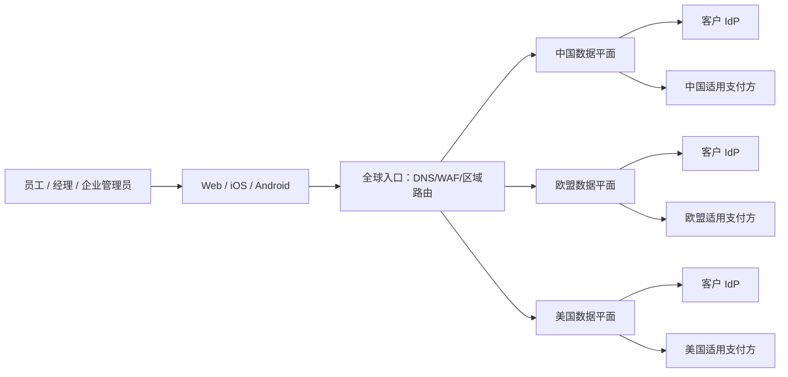

# 01. 架构与数据蓝图

## 1. 系统上下文

全球入口只做边缘防护和基于随机 `tenant_route_id` 的区域选择，不接收或落盘发票、姓名、邮箱、银行信息。未知租户不能通过邮箱域名自动探测区域，避免目录枚举和个人信息外泄。

## 2. 区域数据平面（每区独立部署）

| 组件 | 责任 | 主要数据 |
|---|---|---|
| API Gateway / BFF | 客户端鉴权、限流、接口聚合、幂等键 | 短期请求元数据 |
| Identity & Tenant | SSO 配置、SCIM（可选）、用户映射、会话、角色 | 身份信息、租户配置 |
| Expense | 费用单状态机、明细、币种、附件引用 | 费用与发票元数据 |
| Invoice Pipeline | 预签名上传、病毒扫描、OCR、人工校验队列 | 发票原件与提取字段 |
| Approval | 审批流版本、任务、代理与升级 | 审批记录 |
| Budget & Policy | 预算账本、占用/释放、费用政策 | 预算、规则、余额 |
| Payment Orchestrator | 收款人令牌、支付指令、对账、webhook | 令牌、状态、掩码信息 |
| Notification | 邮件/推送模板和发送队列 | 最小化收件信息 |
| Audit | 追加式审计事件、导出审批 | 操作主体、对象、结果 |
| Regional Data Stores | 关系库、对象存储、队列、缓存、搜索 | 区域内全部业务数据 |

建议先采用“模块化单体 + 独立异步 worker”，按领域建立代码与数据库 schema 边界；只有发票处理、通知、支付 webhook 等伸缩或风险特征明显的能力先独立。避免首版微服务数量过多，同时保留通过事件拆分的路径。

## 3. 多租户隔离

- 所有业务表必须含不可变 `tenant_id`；数据访问层强制注入租户上下文，禁止客户端自由提交该字段。
- 数据库连接使用服务身份，配合行级安全策略或等价的数据库侧防线；缓存键、对象路径、消息主题和搜索索引均以 `tenant_id` 命名空间隔离。
- 高风险或大型客户可升级为独立数据库/账户的 silo 模式；共享模式与 silo 模式使用相同领域接口。
- 后台作业携带签名的租户与区域上下文；跨租户批处理需单独授权并完整审计。
- 企业管理员仅可管理本租户；平台运维使用 JIT 特权访问、双人批准和受控审计会话。

## 4. 数据分类与位置

| 数据 | 建议级别 | 主存储 | 区域规则 |
|---|---|---|---|
| 姓名、邮箱、员工号、IdP subject | 机密/个人信息 | 区域关系库 | 不出 `home_region` |
| 发票图像、商户、税号、地址 | 高机密/可能含敏感个人信息 | 区域对象存储 + 关系库 | 不出 `home_region` |
| 银行账户/收款人资料 | 高机密/金融信息 | 优先由支付方保管；本地保存令牌和掩码 | 不出 `home_region` |
| 预算、审批、支付状态 | 机密业务数据 | 区域关系库 | 不出 `home_region` |
| 审计、安全日志 | 机密 | 区域日志/审计库 | 欧盟日志留欧盟；其他区同样默认本区 |
| 租户路由 ID、区域代码 | 内部 | 全球路由目录 | 不含名称、域名和个人信息 |

**[LEGAL]** 确认“客户数据”的合同定义、各数据类别保留期、欧盟以外两区的数据驻留承诺，以及支持工单、遥测和供应商处理是否构成跨境传输。  
**[SECURITY]** 确认 OCR、反病毒、邮件、推送和可观测性供应商能否按区处理且关闭训练/二次使用。

## 5. 核心流程

### 发票与费用审批

1. 客户端向本区域 API 申请短时、单对象、限大小的预签名上传凭证。
2. 文件进入隔离桶；校验类型/大小/魔数，恶意软件扫描通过后才移动到受控桶。
3. OCR 异步提取；原始结果标注来源与置信度，员工确认后创建费用单。
4. 提交时固定政策与审批流版本，并以预算账本原子地创建“预算占用”。
5. 审批动作带幂等键与乐观锁；通过后生成支付候选，拒绝/撤回则释放占用。
6. 每次状态改变写业务事务与 outbox；审计消费者形成追加式记录。

### SSO 与授权

1. 用户通过租户专属入口或租户代码定位区域。
2. 区域 Identity 服务发起 OIDC Authorization Code + PKCE，或经验证的 SAML 流程。
3. 账号绑定使用稳定 IdP subject/NameID；禁止仅凭可变邮箱静默合并。
4. 平台签发短时会话；服务端按租户、角色、资源关系和金额阈值授权。
5. 管理员、支付和银行信息操作要求强认证；是否强制 MFA 由 **[SECURITY]** 定稿。

### 第三方支付

1. 付款资料在供应商托管页面/SDK 内采集，平台获得区域限定令牌。
2. 审批完成后 Payment Orchestrator 生成唯一支付指令，并写 outbox。
3. adapter 调用区域供应商；重试使用同一幂等键，未知结果进入人工对账而非重复付款。
4. webhook 先验签、持久化原文摘要并去重，再推进支付状态机。
5. 每日以供应商结算文件/API 对账；差异进入隔离队列和双人复核。

**[LEGAL]** 确认各区支付业务角色、资金流、KYC/AML、制裁筛查、税务和牌照边界。  
**[SECURITY]** 在选择采集方式后判定支付卡/银行数据适用范围；不得把“使用第三方支付”写成免除平台义务的结论。

## 6. API 与事件基线

- HTTPS JSON API；版本化路径；写接口支持 `Idempotency-Key`；金额用整数最小货币单位 + ISO 4217 币种。
- 对象使用不可猜测 ID；每次读取都做对象级租户授权，不能依赖前端隐藏。
- 关键事件：`expense.submitted`、`approval.decided`、`budget.reserved`、`payment.requested`、`payment.updated`。
- 事件至少一次投递，消费者必须幂等；禁止在事件中携带发票全文或完整银行信息。
- 对外 webhook 使用签名、时间戳、防重放窗口、轮换密钥和可观测的重试/死信机制。

