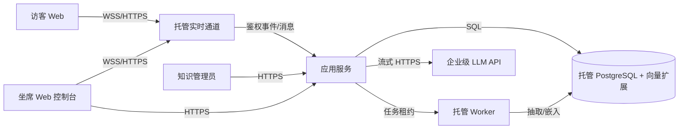

# 系统架构

## 约束与质量属性预算

| Attribute | Target/range | Evidence | State | Revisit trigger |
|---|---|---|---|---|
| AI latency | 请求到界面首 token P95 ≤ 2s（含鉴权、检索、模型与传输） | 分阶段 tracing + 代表性压测 | confirmed | 连续 3 个窗口超标 |
| Realtime scale | 普通聊天峰值 3000 并发连接 | 托管通道配额检查 + 1.5 倍压测 | confirmed | 峰值预测超过 5000 |
| Degradation | LLM/检索故障不阻断人工聊天 | 故障注入 | confirmed | 人工链路出现 AI 依赖 |
| Cost | AI + 基础设施 ≤ ¥50,000/月 | 标签账单、token/会话指标、预算演练 | confirmed | 预测连续 7 天超预算 |
| Availability | 生产 SLO 尚待业务确认 | TBD-DEPLOY-001 | pending | 生产上线前 |

## 系统上下文

信任边界：公网客户端；平台租户边界；托管云账户；经合同批准的 LLM/嵌入供应商。实时通道只承载认证后的租户事件，PostgreSQL 是消息与业务状态的事实来源。

## 容器与部署单元

| Unit | Responsibility | Interfaces | Data owned | Owner | State |
|---|---|---|---|---|---|
| Web clients | 访客/坐席交互、连接恢复、流式展示 | HTTPS/WSS | 本地短期 UI 状态 | 前端 | provisional |
| Managed realtime | 长连接、房间广播、在线状态 | WSS/Webhook/SDK | 短期连接状态，不做事实来源 | 平台 | provisional |
| Modular app | 鉴权、聊天、确认状态机、检索编排、供应商适配 | HTTPS/events | 业务规则 | 后端 | provisional |
| Managed PostgreSQL | 会话、消息、草稿、知识元数据、向量、任务、审计 | SQL | 持久业务数据 | 后端 | provisional |
| Managed worker | 文档抽取、分块、嵌入、删除传播 | DB lease/API | 无独立事实数据 | AI | provisional |
| LLM provider | 流式草稿/嵌入推理 | HTTPS streaming | 按合同最小保留 | AI | provisional |

## 模块边界

| Module | Responsibility | Allowed dependencies | Related SPEC |
|---|---|---|---|
| Identity/Tenant | 会话身份、角色与租户上下文 | IdP, PostgreSQL | SPEC-CHAT-001, SPEC-AI-004 |
| Conversation | 消息持久化、顺序、幂等、分配 | Identity, PostgreSQL, Realtime | SPEC-CHAT-001, SPEC-CHAT-002 |
| Draft Approval | 草稿生命周期与确认发送状态机 | Conversation, Audit | SPEC-AI-003 |
| AI Orchestrator | 检索、prompt、流式代理、超时/熔断、预算 | Knowledge, Provider Adapter | SPEC-AI-001, SPEC-AI-002, SPEC-AI-005 |
| Knowledge | 文档版本、分块、向量检索、发布/撤回 | PostgreSQL, Worker | SPEC-KB-001 |
| Audit/Usage | 不可变审计、token/成本归集 | PostgreSQL, observability | SPEC-AI-004, SPEC-AI-005 |

模块化单体作为一个应用发布，worker 可独立扩缩但共享代码库。Conversation 不依赖 AI Orchestrator，确保人工退化。

## 数据与一致性

| Data/entity | Source of truth | Classification | Consistency/transaction | Retention |
|---|---|---|---|---|
| Tenant/user/role | PostgreSQL/企业 IdP | confidential/personal | 强一致；每次请求绑定 tenant_id | 按企业合同，待生产确认 |
| Conversation/message | PostgreSQL | confidential/personal | 单会话有序序号；幂等键唯一 | 按企业合同，待生产确认 |
| Draft/prompt/reference | PostgreSQL | confidential | 草稿与发送消息分表/状态；版本化 | 最小化，待生产确认 |
| Knowledge/document/vector | PostgreSQL + object storage（如需原件） | confidential | 发布指针原子切换；撤回异步传播 | 按企业策略，待生产确认 |
| Audit/usage | PostgreSQL/日志存储 | confidential | append-only；相关 ID | 安全与财务期限待确认 |

## 接口与集成

| Interface | Contract/versioning | Auth | Timeout/retry/idempotency | Degradation |
|---|---|---|---|---|
| Client API | `/v1` JSON；消息带 client_message_id | OIDC session/JWT | 写入仅幂等重试 | REST 拉取可恢复历史 |
| Realtime events | versioned envelope + sequence cursor | 短期频道 token | 断线指数退避；游标补齐 | 显示离线，恢复后回放 |
| LLM stream | Provider adapter 的统一 chunk/error contract | server-side secret | 首 token deadline；仅安全错误重试；熔断 | 人工模式 |
| Knowledge jobs | DB job row with lease/version | service identity | 至少一次执行；任务幂等 | 旧发布版本继续服务 |

## 实时聊天与草稿动态

1. 消息发送先经应用校验、事务持久化并返回稳定 ID，再由托管实时通道通知对端；客户端按序号补齐，通道不是事实来源。
2. 坐席生成草稿时，应用同步完成轻量检索并调用 LLM 流式 API；token 经现有实时连接或流式 HTTPS 转发，只进入草稿缓冲。
3. 坐席确认时，服务端重新检查草稿版本、权限和最终文本，事务创建正式消息与确认审计，再广播给访客。
4. LLM 熔断只关闭第 2 步，不触碰第 1、3 步的人工消息能力。

## 技术与中间件决策

| Decision | Hard constraints | Candidates | Recommendation | Tradeoff | State | Revisit trigger |
|---|---|---|---|---|---|---|
| 应用形态 | 6 人、预算、快速交付 | 模块化单体 / 微服务 | 模块化单体 + 独立 worker | 部署简单；需守住模块边界 | provisional | 独立团队/发布或隔离需求出现 |
| 数据库/检索 | 租户事务、知识检索、低运维 | PostgreSQL+向量扩展 / 独立向量库 | 托管 PostgreSQL + 向量扩展 | 一库简单；大规模语义检索能力有限 | provisional | 相关性/延迟压测不达标或向量超千万级 |
| 实时通道 | 3000 长连接、双向消息、小团队 | 托管 WebSocket / 自建 WebSocket / 轮询 | 托管 WebSocket/realtime 服务 | 有供应商成本和锁定；显著降低连接运维 | provisional | 配额、地域、成本或顺序恢复无法满足 |
| 缓存 | 2 秒首 token，但当前无热读证据 | 无共享缓存 / Redis | MVP 不引入共享缓存；先优化索引和短生命周期进程内配置缓存 | 少一组件；无法做跨实例热缓存 | provisional | 数据库热读 P95 超预算、需共享限流/临时协调 |
| 队列 | 知识摄取需重试，在线路径需低延迟 | DB 任务表 / 托管消息队列 | 先用 PostgreSQL 任务表 + 托管 worker | 吞吐/扇出有限但运营简单 | provisional | backlog SLO 不达标、需要多消费者/独立重放/削峰 |
| 模型供应商 | 流式、数据不训练、2 秒、预算、地域 | 经审批的企业 LLM API（最多评估 3 家） | MVP 一个主供应商，经 adapter 接入并固定模型版本 | 无自动跨供应商容灾；可控制成本与一致性 | provisional | 主供应商不满足 DPA/地域/P95/预算或业务要求更高 AI 可用性 |

### 何时需要，何时不需要

- 缓存：目前不需要 Redis；PostgreSQL 索引和进程内非敏感配置缓存先满足需求。只有量测证明热读、共享限流、分布式锁或短期状态拖累预算时引入；聊天消息、确认状态、权限与知识发布状态永不只放缓存。
- 队列：知识摄取、嵌入、删除传播这类可重试后台工作需要异步执行，但 MVP 不需要独立 broker，数据库任务表足够。聊天消息、确认发送和 token 流不经过队列；当需要高扇出、突发削峰、多消费者独立扩展或长时间重放时升级到托管队列。
- 实时通道：坐席/访客的双向消息、在线状态和草稿流需要服务器主动推送，因此 MVP 需要；管理页、知识发布和报表不需要实时，普通 HTTPS/短轮询即可。通道故障时以数据库游标恢复，不能代替持久化。
- 模型供应商：生成/嵌入草稿时需要一个满足不训练、流式、地域和预算条件的企业 API；人工聊天、确认发送、历史、权限和审计均不需要模型。MVP 不需要第二供应商自动切换，因为人工退化已满足已知要求；若 AI 本身获得独立高可用 SLO 再增加第二供应商。

## 供应商准入与退出

- 准入硬门槛：合同/DPA 明确客户输入输出不用于训练；可配置的保留/日志策略；目标区域可用；支持流式；压测满足端到端 2 秒；成本可度量和限额。
- 适配层只暴露生成、嵌入、token 用量、错误类别和模型版本；prompt、检索和审批规则归平台所有。
- 禁止把模型供应商 SDK 类型扩散到业务模块；保留导出知识与评测集、切换模型和停用供应商的演练。

## 故障与演进

- Expected degradation: LLM/embedding 故障 → AI 入口关闭、人工聊天继续；realtime 故障 → UI 标记离线并重连补齐；知识任务失败 → 继续使用上一已发布版本。
- Capacity boundaries: 上线前以 4500 连接（目标 1.5 倍）验证通道配额与应用恢复；AI 并发需依据试点请求率和供应商配额测定。
- Split/replace triggers: 模块需要独立发布/团队所有权、资源隔离或单体扩容成本明显失配时才拆服务；检索和后台任务按上表阈值演进。

## 待决定事项

| TBD ID | Decision | Owner | Decision by | Blocked gate | State |
|---|---|---|---|---|---|
| TBD-ARCH-001 | 用目标地区真实会话样本完成 LLM、嵌入与托管实时服务的供应商 bake-off | 技术负责人/安全负责人 | 生产采购前 | production-ready | pending |
