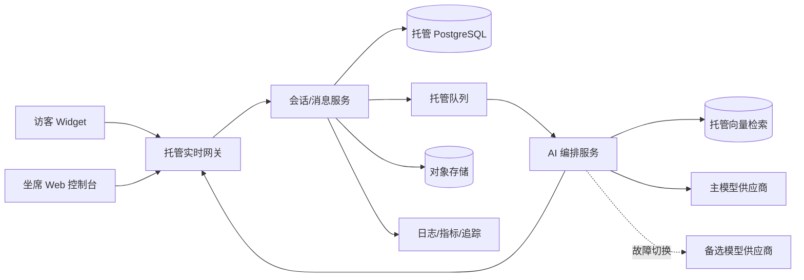

# AI 客服协作平台项目蓝图（草案）

## 1. 目标与边界

为企业坐席提供 Web 控制台，接待访客实时聊天；LLM 结合企业知识库生成流式回复草稿，但任何 AI 内容都必须经坐席确认或编辑后才可发送给访客。

首期约束：

- 普通聊天峰值：3,000 个并发连接。
- AI 草稿：P95 首 token ≤ 2 秒（从坐席侧触发/系统触发到草稿首 token 到达控制台，需单独监测供应商与平台耗时）。
- 模型不可用、超时或限流时，聊天链路继续工作并切换为纯人工。
- 企业会话和知识库数据不得用于模型训练；供应商需提供 API 数据不训练、保留期可控或零保留的合同条款。
- 团队 6 人，优先采用托管服务；AI 与基础设施总预算 ≤ 5 万元/月。

首期不做：AI 自动发送、复杂工单/CRM 全量替代、自建基础模型、自建 Kubernetes、多地域双活。

## 2. 关键用户流程

1. 访客通过 Web Widget 建立会话，经实时网关进入会话服务。
2. 路由服务把会话分配给在线坐席；消息实时同步至坐席控制台并可靠落库。
3. 新消息触发 AI 编排服务：检索企业知识库、构造受限提示词、调用模型。
4. 模型 token 仅流式送入坐席的“草稿区”，绝不进入访客消息通道。
5. 坐席编辑并点击“发送”后，服务端再次校验权限与草稿状态，生成一条独立的人工确认消息并发给访客。
6. AI 超时、报错、限流或被熔断时，草稿区显示“AI 暂不可用”，会话保持在线，坐席继续人工回复。

核心安全不变量：`AI output -> draft only -> agent confirmation -> outbound message`。后端应以不同消息类型和不同 API 强制此约束，不能只依赖前端按钮。

## 3. 推荐架构

推荐组件边界：

- Web：访客 Widget、坐席控制台；可使用 React/Next.js 与托管静态/CDN。
- 实时层：优先托管 WebSocket 服务；负责连接、房间、心跳和在线状态，不作为最终事实库。
- 会话服务：鉴权、租户隔离、坐席分配、消息顺序、确认发送、幂等与审计。
- AI 编排服务：检索、提示词、流式代理、超时/取消、限流、供应商适配和脱敏；与聊天可用性解耦。
- 数据层：托管 PostgreSQL 保存租户、会话、消息、草稿元数据与审计；对象存储保存知识库原文；向量检索首期可用 PostgreSQL + pgvector，规模/召回压力上升后再拆分。
- 异步层：托管队列处理 AI 草稿任务、知识库解析/切片/向量化和低优先级审计任务。
- 可观测性：托管 APM/日志，按租户与链路追踪；正文默认不写日志，敏感字段脱敏。

## 4. 实时与性能设计

- 3,000 并发连接优先交给托管 WebSocket/SSE 平台，按至少 2 倍峰值（6,000 连接）压测并预留突发配额。
- 访客与坐席聊天使用 WebSocket 双向通道；LLM 草稿可复用 WebSocket，或由 AI 服务以 SSE 推送至坐席。若复用，必须按 `tenant_id/conversation_id/agent_id` 授权频道。
- 消息由服务端分配单调递增会话序号；客户端带幂等键，断线重连按最后确认序号补拉，避免丢失与重复。
- P95 首 token 2 秒预算建议：入口与排队 ≤ 150ms，知识检索 ≤ 250ms，提示构造 ≤ 100ms，模型首 token ≤ 1.2s，网络与推送 ≤ 300ms；超出 1.8s 提示“正在生成”，3s 可取消并转人工。
- AI 请求采用短队列、租户公平限流和最大排队时间；宁可快速放弃 AI 草稿，也不拖慢人工聊天。
- 容量验收同时观察连接数、每秒消息数和 AI 同时生成数；后者需要依据实际坐席数与生成频率压测，不能从 3,000 条连接直接等同推导。

## 5. 缓存、队列、实时通道与模型供应商的采用边界

| 能力 | 何时需要 | 何时不需要 / 不应使用 | 首期建议 |
|---|---|---|---|
| 缓存 | 热门知识片段、租户配置、权限短缓存、限流计数；实测数据库成为延迟瓶颈时 | 不缓存会话最终状态、未确认草稿或强一致权限决定；低流量且数据库有余量时不必单独引入 Redis | 先用进程内短缓存和数据库；需要跨实例限流/在线状态或命中收益明确后启用托管 Redis。知识答案缓存必须带租户、知识版本与权限维度 |
| 队列 | AI 请求削峰、租户公平调度、失败重试；知识库解析/向量化等异步任务 | 访客消息实时投递、坐席确认发送不应依赖长队列；若同步 AI 负载很低，可先不用队列 | 使用托管队列。聊天消息先事务落库再发布；AI 队列设置最大等待时间、幂等键、死信队列，模型错误只重试一次或直接降级 |
| 实时通道 | 访客聊天、坐席接待、输入状态、AI token 流式草稿必需 | 后台报表、知识库导入、历史消息检索无需实时通道 | 托管 WebSocket 为主；断线通过 REST 补拉。AI token 可复用授权房间，禁止发到访客频道 |
| 模型供应商 | 需要知识增强草稿、摘要或建议时；供应商必须满足数据不训练、区域/保留和可用性要求 | 人工聊天基础链路、规则化话术、敏感场景不应强依赖模型；合规条款不满足时不用该供应商 | 建立供应商适配层；先选一个主供应商，配置一个经过小规模验证的备选，避免首期同时运营多家造成复杂度。主模型故障时可切备选，也允许直接关闭 AI 转人工 |

缓存不作为事实源，队列不阻塞实时聊天，实时通道不承担永久存储，模型供应商不拥有“发送给访客”的权限。

## 6. 数据、安全与合规

- 所有核心表包含 `tenant_id`；数据库启用行级隔离或等价的服务端强制过滤，知识检索也必须先做租户和文档 ACL 过滤。
- 传输与静态数据加密；密钥进入托管密钥服务，生产环境最小权限访问。
- 发往模型前进行必要字段筛选/脱敏，不发送无关历史；对高敏租户支持关闭 AI 或独立策略。
- 选择企业级 API 合同：输入输出不用于训练、明确保留时长、支持零保留优先、可签数据处理协议；上线前由法务/安全确认。
- 审计记录知识版本、模型/版本、提示词模板版本、草稿、编辑差异、确认人和发送时间；正文日志设置最小化及保留期限。
- 防提示词注入：检索内容视为不可信数据，系统指令与知识正文隔离，禁止工具任意调用；输出做敏感信息与越权引用检查。

## 7. 高可用与降级

| 故障 | 平台行为 |
|---|---|
| 主模型超时/5xx/限流 | 快速熔断；可尝试一次备选模型，仍失败则关闭该次草稿并提示人工回复 |
| 向量检索不可用 | 不生成基于知识库的答案；避免让模型凭空回答，可提供人工话术模板 |
| AI 队列积压 | 超过最大排队时间丢弃草稿任务，优先保证新请求和人工聊天 |
| 实时网关短暂中断 | 客户端指数退避重连，按最后序号补拉；已确认消息以数据库为准 |
| 数据库异常 | 暂停发送并显式提示，不虚假显示已送达；恢复后用幂等键安全重试 |

目标建议：聊天核心链路月可用性 99.9%，AI 草稿作为非关键增强能力单独设 SLO；任何 AI 故障不得降低人工消息收发可用性。

## 8. 预算草案（每月上限 5 万元）

建议设置硬预算和告警，而不是假设所有 3,000 在线访客都持续调用模型：

| 项目 | 月预算上限（人民币） | 控制手段 |
|---|---:|---|
| 模型推理与嵌入 | 25,000 | 小/快模型默认、上下文裁剪、按租户配额、生成上限、失败不多次重试 |
| 托管数据库/备份/对象存储 | 8,000 | 合理规格起步，冷热数据分层 |
| 实时网关、计算与队列 | 9,000 | 自动扩缩容、连接与消息配额告警 |
| 监控、日志、CDN/WAF | 4,000 | 正文不入日志、采样追踪、保留期控制 |
| 预备金 | 4,000 | 峰值流量及供应商价格波动 |
| 合计 | **50,000** | 达到 70%/85%/95% 分级告警，95% 时收紧非关键 AI 用量 |

上线前必须用真实平均输入/输出 token、AI 触发率和供应商报价建立成本模型：`月 AI 成本 = 请求量 ×（输入 token 单价 + 输出 token 单价 + 检索/嵌入成本）`。若估算超预算，依次采用：缩短上下文、降低自动触发率、默认更小模型、租户配额；不牺牲人工聊天链路。

## 9. 交付计划（6 人团队，约 10–12 周）

建议分工：2 名前端、2 名后端、1 名 AI/检索、1 名测试兼平台工程；安全和产品验收由团队共同承担。

1. 第 1–2 周：需求冻结、数据模型、威胁建模、供应商合规与首 token 基准测试；完成访客/坐席原型。
2. 第 3–5 周：实时聊天、鉴权/租户隔离、坐席路由、消息可靠性、审计与托管基础设施。
3. 第 5–7 周：知识库摄取、检索、AI 流式草稿、人工确认闸门、超时/熔断/纯人工降级。
4. 第 8–9 周：端到端测试、断网恢复、越权与提示词注入测试、3,000/6,000 连接及 AI 并发压测。
5. 第 10–12 周：少量租户灰度、成本与质量评估、告警/runbook、故障演练后上线。

## 10. 验收标准与待验证假设

- 服务端不存在绕过人工确认直接将 AI 草稿发给访客的路径；自动化测试覆盖权限与状态机。
- 3,000 并发下聊天消息可稳定收发，按 6,000 连接完成余量测试；断线重连无消息丢失，重复可幂等消除。
- 在约定地区、知识库规模、提示长度和目标模型上，AI 首 token P95 ≤ 2 秒；按供应商、租户和时间段拆分观测。
- 主模型被故障注入后，人工聊天不受影响，坐席获得明确提示；备选切换或纯人工降级符合预期。
- 月成本预测与灰度实测均不超过 5 万元上限，并有自动告警与用量保护。
- 租户隔离、数据不训练条款、保留期、删除流程、审计与备份恢复通过安全验收。

待产品尽快量化但不阻塞技术草案的假设：峰值每秒消息数、同时在线坐席数、AI 草稿触发比例、平均上下文/token、知识库容量、数据驻留区域、消息保留期以及第三方 CRM 集成范围。这些数据决定最终实例规格和模型预算，而不改变上述架构边界。
