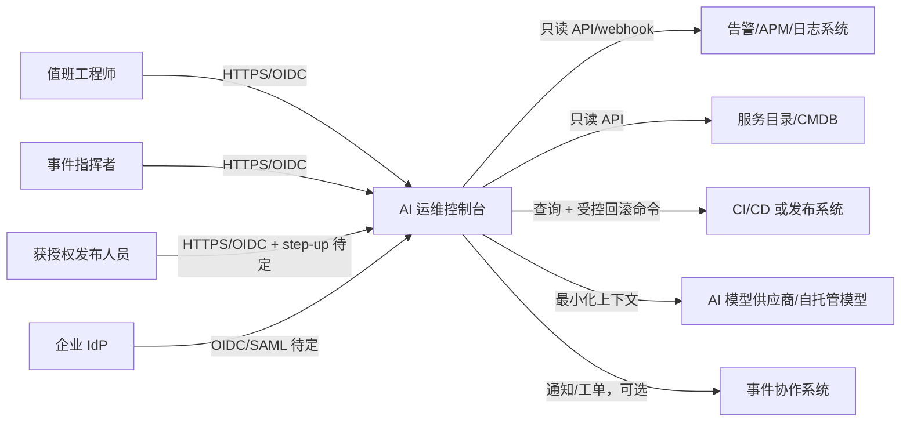
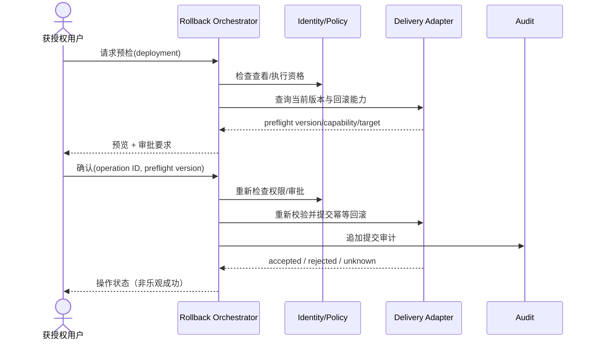

# 系统架构

## 约束与质量预算

| Attribute | Target/range | Evidence | State | Revisit trigger |
|---|---|---|---|---|
| 安全性 | AI 无生产写凭据；回滚需确定性权限/预检/幂等/审计 | 威胁建模、集成与权限测试 | provisional | 回滚控制模型改变 |
| 可用性 | AI 或单一只读来源失败不阻断已有证据与人工回滚路径 | 故障注入 | provisional；数值 TBD-NFR-001 | SLO 确认 |
| 性能/新鲜度 | 未提供，不虚构 p95 或同步间隔 | 真实工作流测量计划 | pending（TBD-NFR-001） | 用户研究/规模确认 |
| 规模/容量 | 用户、事件、服务、部署、日志量均未知 | 容量画像 | pending（TBD-NFR-001） | 数据盘点 |
| 恢复 | RTO/RPO 未提供 | 恢复演练计划 | pending（TBD-RECOVERY-001） | 数据分类完成 |
| 成本 | 无预算，不承诺供应商/模型用量 | 用量与预算护栏 | pending（TBD-PRODUCT-001, TBD-AI-001） | 预算确认 |

## 系统上下文

- 信任边界：用户浏览器、控制台运行区、各外部系统、AI 提供方是独立边界。外部响应均不可信并需验证。
- 权威性：告警系统拥有原始告警；服务目录拥有服务关系；发布系统拥有部署/回滚终态；控制台拥有人工判断、操作编排与审计关联。具体系统 pending（TBD-INTEGRATION-001）。

## 容器与可部署单元

| Unit | Responsibility | Interfaces | Data owned | Owner | State |
|---|---|---|---|---|---|
| Web client | 告警/影响/回滚 UI、无障碍状态、无特权业务决策 | HTTPS JSON API | 仅短期界面状态 | Web 团队 | provisional |
| Application API（模块化单体） | 授权、聚合、影响模型、回滚编排、审计、AI 网关 | HTTPS；外部适配器 | 事件投影、人工判断、操作与审计索引 | 应用团队 | provisional；ADR-0001 |
| Database | 事务数据、外部 ID 映射、幂等键、操作状态、审计 | 应用私网连接 | 控制台记录源 | 数据/应用团队 | provisional |
| Background worker | 来源同步、AI 任务、回滚状态轮询、通知 | 数据库任务表 provisional | 任务租约/状态 | 应用团队 | provisional |
| External systems | 原始观测、目录、部署执行和身份 | 供应商 API | 各自权威数据 | 外部系统 owner | pending |

## 模块边界

| Module | Responsibility | Allowed dependencies | Related SPEC |
|---|---|---|---|
| Identity & Policy | 登录身份、角色/属性、动作授权与审批检查 | IdP adapter；policy config | SPEC-IMPACT-002, SPEC-ROLLBACK-002, SPEC-AUDIT-001 |
| Alert Intake | 规范化告警、来源状态和新鲜度，不改写原始 payload 引用 | observation adapters；database | SPEC-ALERT-001, SPEC-ALERT-002 |
| Incident Workspace | 事件聚合、人工确认/纠正、时间线 | Alert、Impact、Audit 接口 | SPEC-IMPACT-001, SPEC-IMPACT-002 |
| Impact Evidence | 确定性关系、证据分类和缺口 | catalog/deploy adapters | SPEC-IMPACT-001 |
| AI Gateway | 上下文最小化、提示/模型版本、输出验证、引用映射；无 Delivery 依赖 | model adapter；evaluation metadata | SPEC-AI-001, SPEC-AI-002 |
| Rollback Orchestrator | 能力查询、预检、审批、幂等提交、状态协调 | Identity；delivery adapter；Audit | SPEC-ROLLBACK-001..003 |
| Audit | 追加式安全事件与查询/导出策略 | database；外部审计 sink 可选 | SPEC-AUDIT-001 |
| Integration Adapters | 外部契约、超时、重试、速率限制和深链 | 单一对应外部系统 | 所有集成规格 |

规则：AI Gateway 不得依赖 Rollback Orchestrator 的命令接口；Web client 不得直连发布系统；适配器不得把外部字段泄漏成领域契约。

## 数据与一致性

| Data/entity | Source of truth | Classification | Consistency/transaction | Retention |
|---|---|---|---|---|
| 原始告警引用/快照 | 外部告警系统；控制台为投影 | internal/confidential provisional | 按 source ID 幂等 upsert；显示来源时间 | TBD-SECURITY-001 |
| 服务关系投影 | 服务目录 | internal provisional | 最终一致；携带版本/同步时间 | TBD-SECURITY-001 |
| 影响判断 | 控制台 | confidential provisional | 追加事件 + 当前投影同事务 | TBD-SECURITY-001 |
| 回滚操作 | 控制台编排记录；终态以发布系统为权威 | highly-sensitive operational provisional | 唯一 operation ID/idempotency key；状态单调转移，未知可恢复 | TBD-SECURITY-001 |
| 审计事件 | 控制台/外部审计 sink | highly-sensitive provisional | 追加写；关联 correlation/operation ID | TBD-SECURITY-001 |
| AI 输入/输出元数据 | 控制台；输出非事实源 | confidential provisional | 固定输入引用 + prompt/model/eval version | TBD-AI-001 |

禁止把大段原始日志默认复制到数据库或 AI 上下文；只保存任务需要的最小片段/引用，最终策略 pending。

## 集成与接口

| Interface | Contract/versioning | Auth | Timeout/retry/idempotency | Degradation |
|---|---|---|---|---|
| Web → API | 版本化 JSON；错误含稳定 code/correlation ID | OIDC session + CSRF 防护 provisional | 安全读可重试；写需 idempotency key | 显示局部错误/最后数据 |
| Alert/Catalog read | 适配器映射 + contract tests | 每集成独立 machine identity | 有界 timeout；抖动退避；不无限重试 | 标陈旧/部分/未知 |
| Delivery capability/preflight | 读取权威当前状态与 capability token/version | 最小权限 machine identity | 短期预检有效性 pending；重新校验 | 禁止提交 |
| Delivery rollback command | 版本化命令，带 operation/idempotency ID 和预检版本 | 独立写凭据 + 用户委托上下文待定 | 仅按可证明幂等规则重试 | 状态未知 + 人工核验，绝不自动二次命令 |
| AI model | provider-neutral request/structured response schema | 独立低权限凭据 | 有界 timeout；有限重试；circuit breaker | 确定性证据 UI，不阻断核心流程 |

具体 timeout/retry 数字为 pending（TBD-NFR-001）；在确认外部幂等契约前，不对写操作启用自动重试。

## 回滚动态视图

并发约束：同一部署是否允许并发操作由发布系统能力决定；默认 provisional 为单一进行中操作，数据库唯一约束和权威系统复核共同防止重复。

## AI 边界

- 输入仅来自已授权、已分类并可追踪的上下文；用户输入和外部日志均视为不可信数据，不作为工具指令。
- 输出采用结构化 schema，引用只能指向输入 evidence ID；服务名、版本、环境等关键字段由应用从权威数据渲染，不从生成文本解析。
- 模型组件没有发布系统写凭据，也不能调用 Rollback Orchestrator 命令接口。
- 版本记录包含 prompt、模型、输入引用集合、策略与评测版本；具体保留和供应商训练使用 pending（TBD-AI-001）。
- 离线评测必须覆盖无证据、冲突证据、提示注入、敏感信息外泄、拒答和供应商失败；阈值不得在无样本时虚构。

## 技术与中间件决定

| Decision | Hard constraints | Candidates | Recommendation | Tradeoff | State | Revisit trigger |
|---|---|---|---|---|---|---|
| 应用形态 | 一个开发团队（confirmed），权限/审计强一致，未知规模 | 模块化单体；微服务；serverless 函数组合 | 模块化单体 | 独立扩缩/故障隔离较弱，换来事务和交付简单 | provisional；ADR-0001 | 独立团队/发布边界或测得隔离需求 |
| Web 栈 | 高密度交互、无障碍、团队技能未知 | TypeScript + React/Next.js；Vue/Nuxt；团队既有栈 | TypeScript + React/Next.js 作为工作默认 | 学习/构建成本取决于团队 | provisional；TBD-ENGINEERING-001 可替换 |
| 数据库 | 事务、幂等、审计关联 | PostgreSQL；现有企业关系库；文档库 | 托管 PostgreSQL | 运维/供应商成本，schema 演进需纪律 | provisional | 现有标准、区域或访问模式不适配 |
| 后台任务 | 同步/轮询需耐久；规模未知 | 数据库任务表；Redis queue；broker | 数据库支持的 worker/任务表 | 吞吐和复杂路由有限，少一个中间件 | provisional | 测得积压/扇出/隔离需求 |
| 缓存 | 无热点证据 | 无共享缓存；Redis | 首期无 Redis，使用 DB 索引/HTTP cache | 峰值余量较小 | provisional | 测得热点或共享短期协调需求 |
| 搜索 | MVP 结构化筛选，无相关性证据 | DB 查询/全文；搜索引擎 | 数据库查询 | 高级相关性/分面有限 | provisional | 数据/查询证明不足 |
| 实时 | 回滚进度需更新，延迟目标未知 | polling；SSE；WebSocket | 有界 polling 起步 | 更新延迟/请求开销 | provisional | TBD-NFR-001 要求服务器推送或规模超预算 |
| AI provider | 数据地域/模型/成本未知 | 托管 API；企业模型网关；自托管 | provider-neutral adapter，不锁具体模型 | 不能利用单供应商全部特性 | provisional；TBD-AI-001 | 数据政策与评测选择后 |
| 部署平台 | 区域、组织平台能力未知 | managed container/PaaS；serverless；Kubernetes | 托管容器/PaaS | 平台约束与可移植性权衡 | provisional；TBD-DEPLOY-001 | 平台标准或工作负载证明 K8s 必要 |

每个被采用的外部组件必须在实现前补齐 owner、失败模式、观测、成本驱动、本地开发和移除路径；当前未知不得解释为已选定供应商。

## 失败与演进

- Expected degradation：单个只读来源失败 → 局部陈旧/未知；AI 失败 → 隐去归纳但保留证据；发布读取失败 → 禁止新回滚；提交后状态失败 → 保留 operation ID 并转人工核验。
- Capacity boundaries：均 pending（TBD-NFR-001）；不得用微服务掩盖未知规模。
- Split/replace triggers：出现独立团队与发布节奏、法规隔离、已测的资源争用/SLO 冲突，或数据库任务表无法满足已确认积压/恢复目标时才拆分。
- Adapter exit：领域模型只依赖内部端口；所有外部 ID、深链、能力与错误映射在适配器内；替换供应商须通过同一契约套件。

## 待决定事项

| TBD ID | 决定 | Owner | Decision by | Blocked gate | State |
|---|---|---|---|---|---|
| TBD-ARCH-001 | 确认架构负责人和模块化单体基线 | 工程负责人 | 架构评审 | implementation-ready | pending |
| TBD-INTEGRATION-001 | 盘点外部系统契约、权威性、配额、幂等与退出路径 | 平台负责人 | 适配器设计前 | implementation-ready | pending |
| TBD-NFR-001 | 确认延迟、新鲜度、可用性、规模和容量预算 | SRE/产品负责人 | 架构评审前 | implementation-ready | pending |
| TBD-IDENTITY-001 | 确认身份、策略、审批和用户委托模型 | 安全负责人 | API 设计前 | implementation-ready | pending |
| TBD-ROLLBACK-001 | 确认回滚契约、状态机、并发、停止和补救 | 发布负责人 | 回滚实现前 | implementation-ready | pending |
| TBD-AI-001 | 确认数据政策、模型供应商、版本与评测门禁 | AI/安全负责人 | AI 实现前 | implementation-ready | pending |
| TBD-ENGINEERING-001 | 以团队能力确认或替换 provisional 技术栈 | 工程负责人 | 首个实现任务前 | implementation-ready | pending |
| TBD-DEPLOY-001 | 确认运行平台、网络与区域 | 平台负责人 | 部署设计前 | production-ready | pending |
| TBD-RECOVERY-001 | 确认 RTO/RPO 与恢复设计 | SRE/数据负责人 | 上线评审前 | production-ready | pending |
